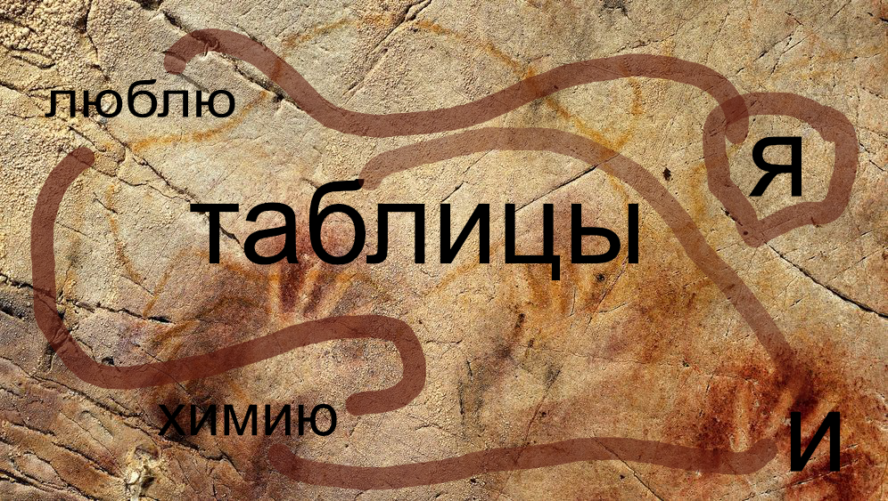

Ihr könnt in der Dunkelheit nichts sehen. Ihr zündet eine Fackel an. Neben einem erloschenen Lagerfeuer seht ihr ein Skelett. Die knochrigen Finger des toten Mannes umklammern einen schwarzen Steinbrocken. Ihr haltet eure Hand ins Licht und staunt nicht schlecht, als ihr eine Ähnlichkeit erkennt. Ihr habt eine Ahnung...einen Verdacht...vielleicht war dieser Mann auch auf der Suche nach der Karte...vielleicht war er schon einen Schritt voraus, hatte aber auf seiner Suche noch kein Glück.

Plötzlich seht ihr im Schimmer des Lichts, das die Fackel wirft, dass an der Höhlenwand kryptische Zeichen stehen. Einer von euch beiden hofft nun darauf, dass das Studium des anderen nicht ganz umsonst war...

 